## Escuela Colombiana de Ingeniería

### CVDS – Parcial práctico
### Parcial Segundo Tercio

## Autor: David Arturo Narváez Lossa

## Solución 

1. Inicialmente clone el repositorio con el comando
~~~
git clone https://github.com/isanchezf/2022-2-par2t.git
~~~
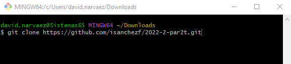

2. Ya teniendo el repositorio de manera local, lo primero fue compilar con ayuda de maven 
~~~
mvn compile
~~~
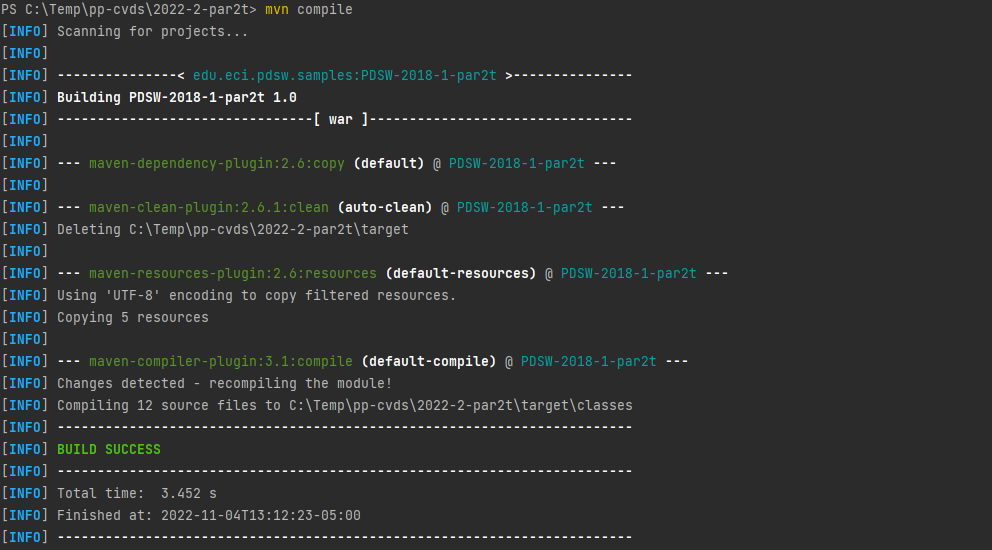

3. Posteriormente probamos el servidor web local con el comando
~~~
mvn tomcat7:run
~~~
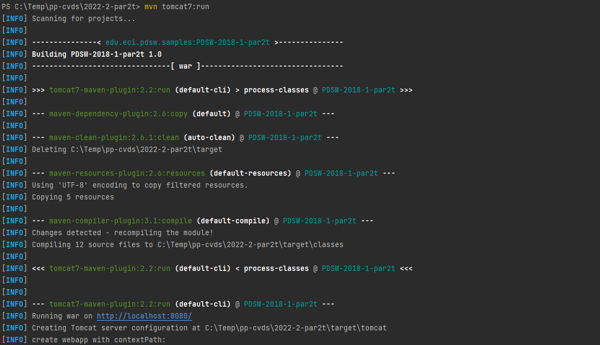
4. Una vez hecho esto, podiamos ver lo que aparece en nuestro navegador escribiendo en la barra de busqueda
~~~
http://localhost:8080/consultaPaciente.xhtml
~~~
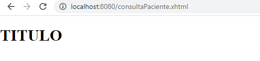

aquí únicamente era visible el "titulo" puesto que la dirección estaba incompleta y para modificarlo debiamos poner
~~~
http://localhost:8080/faces/consultaPaciente.xhtml
~~~
5. Ahora vamos a implementar la primer consulta (consultarPacientePorId), para ello entramos a **PacienteMapper.xml** aquí realizamos la consulta de tipo sql, pero
en el select agregamos **parameterType** puesto que en esta primer consulta debemos ingresar dos parámetros **id** y **tipo_id**
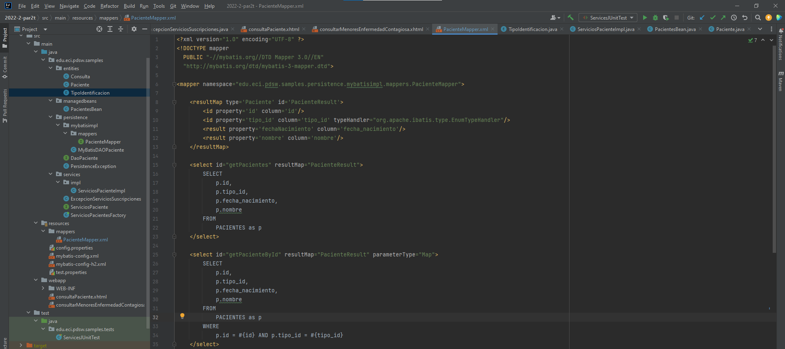
~~~
<select id="getPacienteById" resultMap="PacienteResult" parameterType="Map">
        SELECT
            p.id,
            p.tipo_id,
            p.fecha_nacimiento,
            p.nombre
        FROM
            PACIENTES as p
        WHERE
            p.id = #{id} AND p.tipo_id = #{tipo_id}
    </select>
~~~
6. En la carpeta de persistencia, modificamos la interfaz de mappers **PacienteMapper** con la nueva función **getPacienteById**
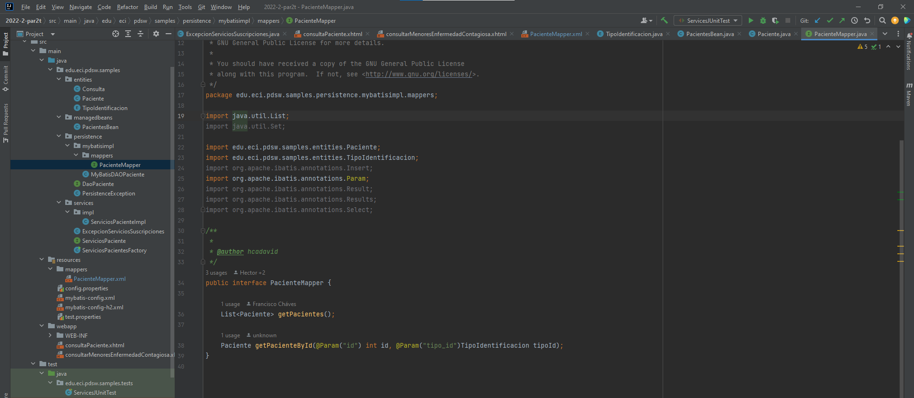
7. De igual manera lo hacemos tanto en la interfaz **DaoPaciente** y en la clase **MyBatisDAOPaciente**
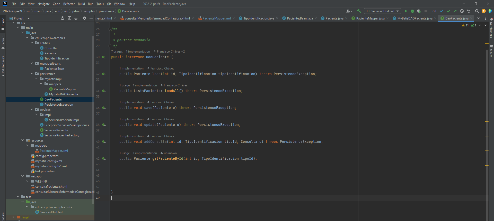
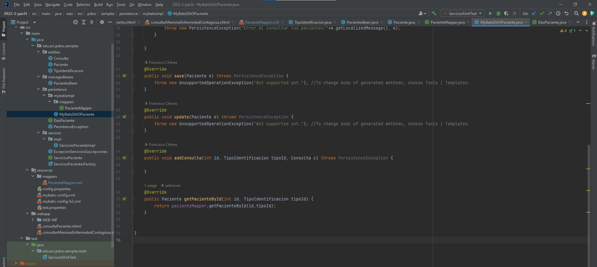
8. En la parte de servicios modificamos la función **ConsultarPacientesPorId** en la clase de **ServiciosPacientempl** de manera que la interfaz emplea la función
**getPacienteById**
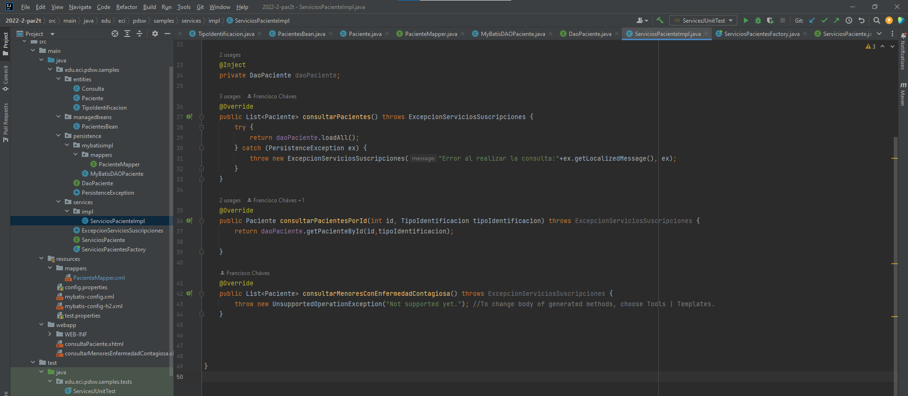

9. Para probar esta nueva consulta lo realizamos en **ServicesJUnitTest**  allí llamamos a nuestra función de **consultarPacientePorId** guardando previamente 
el nombre del paciente y lo verificamos con ayuda de un Assert.assertEquals; en este caso el nombre era **Carmenzo** y como ambos nombres son iguales está bien
~~~
 Paciente paciente = ServiciosPacientesFactory.getInstance().getTestingForumServices().consultarPacientesPorId(9876, TipoIdentificacion.TI);
 Assert.assertEquals(paciente.getNombre(),"Carmenzo");
~~~
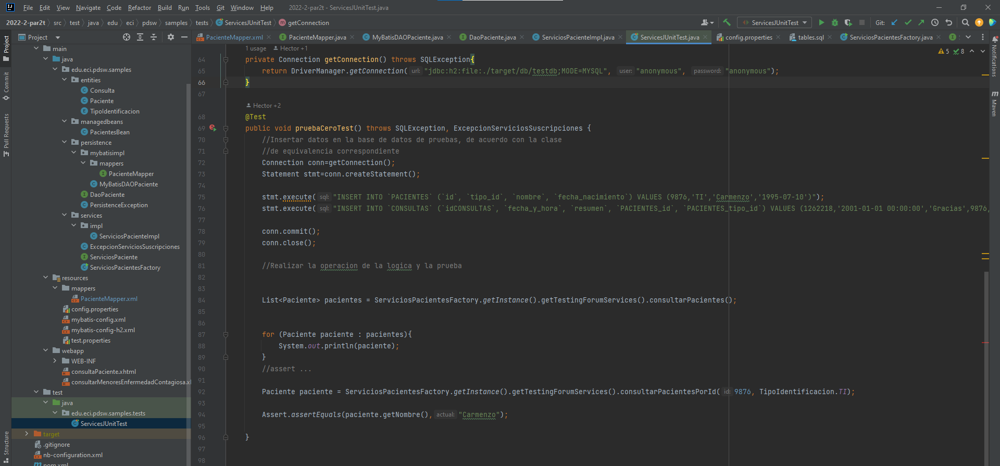


## Historia de usuario #1

  -------------------------------------------------------------------------------------------------------------------------------------------------------------------------------------
  > **Como** Usuario de la plataforma de consultas médicas
  >
  > **Quiero** Poder consultar un paciente a partir de su número y tipo de identificación.
  >
  > **Para** Poder hacer una revisión de las consultas realizadas por un paciente cuyo documento ya conozco, y así evitar la búsqueda por el nombre del paciente.
  >
  > **Criterio de aceptación:** Se debe mostrar la fecha de nacimiento del paciente, su nombre, y cada una de las consultas realizadas. Las consultas deben estar organizadas de la más reciente (mostrados arriba) a la más antígua, y deben mostrar la fecha y el resúmen.

## Historia de usuario #2

  -------------------------------------------------------------------------------------------------------------------------------------------------------------------------------------
  > **Como** Usuario de la secretaría de salud de la plataforma
  >
  > **Quiero** Tener un reporte de las consultas de los menores de edad (menóres de 18 años) en las que en el resúmen se encuentren enfermedades contagiosas.
  >
  > **Para** Conocer con rapidez qué pacientes debo revisar y tomar medidas al respecto.
  >
  > **Criterio de aceptación:** El reporte NO debe requerir entrar parámetro alguno. Se considerán como enfermedades contagiosas: 'hepatitis' y 'varicela'. El reporte sólo debe contener el número y tipo de identificación  del paciente y la fecha de nacimiento, ordenados por edad de mayor a menor.
  -------------------------------------------------------------------------------------------------------------------------------------------------------------------------------------

El modelo de base de datos y de clases asociados a la implementación parcial son los siguientes:

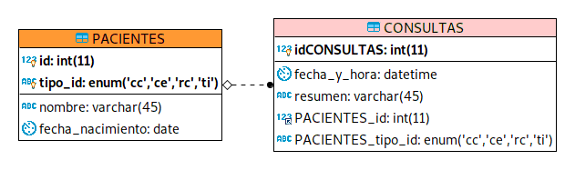

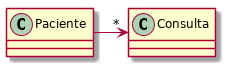

A partir de la aplicación base suministrada, debe realizar lo siguiente:

Dado un número y tipo de identificacion de un paciente, mostrar el paciente y las consultas que ha realizado esde paciente.

Mostrar los pacientes menores de edad que en sus consultas se encuentren las enfermedades: hepatitis o varicela.


1.  (20%) A partir de la especificación hecha en los métodos
    *consultarPacientesPorId* y *consultarMenoresConEnfermedadContagiosa* de la fachada de
    servicios (la parte lógica de la aplicación), implemente sólo una prueba (la que considere más importante para validar las especificaciones y los criterios de aceptación). Siga el esquema usado en ServicesJUnitTest para poblar la base de datos volátil y verificar el comportamiento de las operaciones de la lógica.

2.  (40%) Implemente la historia de usuario #1, agregando todo lo que haga falta en la capa de presentación, lógica y de persistencia. La vista debe implementarse en consultaPaciente.xhtml.

3.  (40%)Implemente la historia de usuario #2, agregando todo lo que haga falta en la capa de presentación, lógica y de persistencia. La vista debe implementarse en consultarMenoresEnfermedadContagiosa.xhtml.


## Entrega

1. Documentar la solución en Readme de Git.

## Bono

Si después de realizado el parcial, de forma INDIVIDUAL encuentra defectos menores (que impliquen a lo sumo cambiar 5 líneas de código), y que al corregirlos permiten que los puntos 2 o 3 funcionen:

1. Haga los ajustes en su código.

2. Haga un nuevo commit con el mensaje "entrega bono, ahora funciona el Punto XX" , donde XX es el punto que se corrigió. 

3. Ejecute:

    ```bash
    $ git diff --stat HEAD HEAD^^
    ```

4. Si el resultado del comando anterior es menor o igual a 10, puede aplicar al bono.

5. Comprima la nueva versión siguiendo el esquema indicado en el parcial, y súbalo a más tardar el 24 de Marzo a las 11:59pm en el espacio correspondiente.

